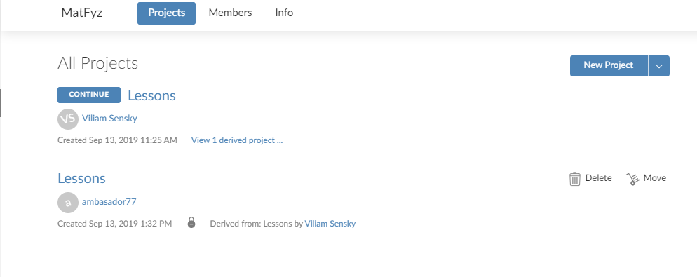
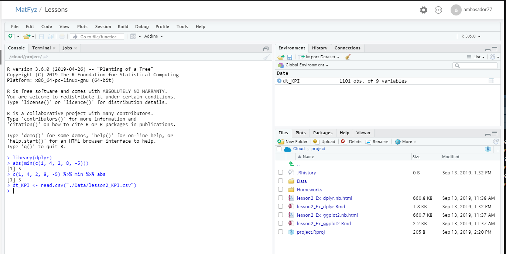

# RStudio Cloud

#### About
Maybe you have heard about or even used RStudio desktop software. It is an environment that makes work with R smoother and easier. It was created by RStudio developers to make R accessible to everyone. The project enables you to use RStudio without any need for installing anything on your computer. At the same time it makes it possible to collaborate on R projects within the cloud.

During this course we will use RStudio Cloud to share the course content and publish the assignments.

#### Creating an account
There are multiple ways of creating a new account. There is a possibility to use an email, Google or GitHub account. To create an account please visit [RStudio Cloud](https://rstudio.cloud), go to the signup section and create a new account.

#### Joining the course
After you have created your account, you will be able to join our course. To get into the project click [here](https://rstudio.cloud/spaces/24950/join?access_code=SdZVz8k8LZVMEv9rnuMHa4Toie5gL9fUHMKn41bb). You will be asked if you want to join the project space.

After you confirm, you will enter the workspace of this class. You will be able to see all projects that belong to the course. 

When you open a particular project, it will have the same appearance as RStudio software.

The console, where you write your code is on the left, with the possibility to open .R and .Rmd files in the file browser. In the top right section there is the environment containing your workspace during your work in R. That's the place where you can see all your current variables and objects. In the right bottom section you will be able to see the file manager that will enable you to navigate the files in the projects, see the plots that you create, and view and install packages.

[Back](/Lessons/Lesson1/README.md)