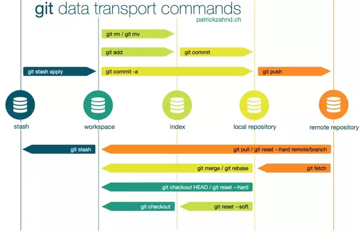

# This section will try to answer the following questions:
* What is GIT?
> This is the way we make sure we can all collaborate on the same class, that is publicly available, we all have up to date information, but we never destroy the original content (called master). Consider visiting [git wiki](https://en.wikipedia.org/wiki/Git) for more details.
* How is it used
> GIT is a piece of software that is installed on your computer and allows you to send commands via command line or other software (e.g. R). You are able to operate "git" commands on any directory, that contains git folder set up. 
> For this class, the directory is already set up here in [github](https://github.com/ex-man/GeneralInsurance_Class), so it is enough to clone it (build a replica) in your local machine. You can do so from R Studio directly, and this is what we recommend, as this class will do 99% of the things using R.
* How to set it up
> It is worth installing GIT before using it to save yourself some trouble. To check whether or not you have git installed, simply open a terminal window (*cmd.exe in windows*) and type "git --version".
* How to start
> We will be using GitHub for this entire class, so you need to create an account there (you may have one already).

> Then you need to **Fork**  our repository. This will create a replica of our class under your account and you can make changes there directly such as writing notes without messing around with anyone. 

> Then you need to **Clone** your web directory to your local machine. The best way of doing this is directly via [R Studio](http://www.audhalbritter.com/wp-content/uploads/2016/12/Github-%E2%80%93-R-studio-Cheat-Sheet.pdf) by opening a project from Git repository.
> Remember to use your own **Fork** of this class. Otherwise you will not be allowed to update any content.

* Why is there add, commit and push?
> Git is a great tool, because it has multiple stages of your saved work. Leaving the branches apart, there are already a number of repositories.
> There is your current folder (you can check status of it), then there is your local "staging" area, where you move files using *git add*.
> Then there is also your on-line "staging" folder, where you move stuff from your local "staging" using *git commit*.
> Once you are happy with everything, you *git push* your changes and make them visible to everyone.

> Why is it so complicated? Well, there are always short-cuts you can make. Using R you skip many of these steps, but in reality, there are many situations,
> when you want to do partial saves, as you are not sure what will work best. These "complicated" steps will help you achieve it.

* How to publish content (git push)
> Once you are happy with the changes, you need to save them to your (master) repository. This is achieved via *git push* command. This will only push the changes you have committed earlier, and raise any conflicts. We are not expecting to have any conflicts in this class, but if they arise, we will look at resolving them.
> Remember to commit often and push reasonably frequently as well. There is no "auto-commit" and "auto-push" that you may be familiar from editors like MS Word (auto-save).

* How to synchronise content (git pull or git checkout)
> There will frequently be new content available, that is produced by others. You may want to download this content to make your local copy of the directory up to date. **Pull** takes the "new" things from master directory, but you may sometimes want to **Checkout** everything to have a fresh copy of all data (this will overwrite all changes and checkout the branch as pushed).

* Branches
> **Branches** allow you to do a parallel development. They are very powerful, but we are  not planning to using them. You can use official documentation or watch some YouTube to learn more. 

# How it links to this class
Hopefully you got some insight above about what git is. We decided to use it for this class (despite being and overkill) to allow us to be more up to date with the technology stack and to allow us to interact with you better. And we want to avoid sending emails back and forth. It also has one additional feature, and that is described bellow...

## Homework checking using pull requests
We want to make sure you practice what we do in the class also at home and do not loose contact with the class. On the other hand, we work full time, so we need your help with checking what you have done. You should be sending *pull requests* to our git project and then comment on other requests saying why they are better or worse then yours.

If you are using GitHub UI, it will navigate you through the process of getting the content of the pull request and then also via *check-out* of the right branch, and then it also suggest how to *git merge* it with your current code.

For more information on [pull requests](https://help.github.com/articles/checking-out-pull-requests-locally/) click on the link. *
