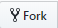

# Basic GitHub Actions

In this section we will provide a brief description of how to do some of the basic GitHub actions that we will require you to use throughout this course. To see what these actions actually mean and what they do, please look at the previous section.

### Fork

We will start with the fork, since this will be the first thing you will need to do to get all the course material to your repository. To fork someone else's repository, you need to find the original repository first. So in this case you want to find our GeneralInsurance_Class repository. Then you need to click on the fork button

### Commit

In previous section we described how the committing works. Now we will have a look at how to do it in GitHub.

To make a change in a file on GitHub go to the file, open it and start editing it. 

When you're done, scroll down and click on "Commit Changes" button. To be able to submit the commit a commit header will have to be edited. Then, if you think the changes you made need longer description, you can add additional comments in the commit message box.

You can submit your commit either directly to your master branch (this option is the one you should do in this course) or you can choose to create a new branch with the new commit

Commits are the way you will submit your solutions to homework assignments.

### Updating to most recent version of course materials

To keep your repository updated with the most recent changes made in the main course material repository, you can use pull requests. 

As described in previous section, pull requests can be used to notify the main developer that there are some changes made and s/he can consider updating their own repository with the changes made by someone else.

On the other hand, you can also create a pull request going the other way - pulling updates from the original repository to your own. Since you are basically requesting yourself to pull the changes from the original repository into your own, you can approve it any time.

So to do it you'll need to follow these steps. First, go to your own repository and click on the "New pull request" button.

Now there you choose the way you want to create the pull request. The direction of the pull request is indicated by a small arrow symbol. You have to select repositories from the dropdown lists so that your repository and the branch where you want to store the data from the pull request are on the side to which the arrow is pointing. On the other side of the arrow must be the repository and branch from which you want to pull the changes. In this case it is [ex-man/GeneralInsurance_class](https://github.com/ex-man/GeneralInsurance_Class).

Then you click on the "Create pull request" button. Since this will also create a commit that will contain updates to one or more files, you will have to provide message and in case you want to describe more in detail what is happening in the pull request, you can add a longer comment in the comment block. At the end you will create the pull request by clicking on the "Create pull request" button.

Now the last step is to merge the pulled data into your repository. You just confirm the merge by clicking on the button.

In case you changed your mind and you don't want to update your repository, you can close pull request without merging. In that case your repository remains unchanged as if nothing happened.

Important thing to note is that when you update your repository this way, the changes you made up to that point in your repository remain the same even when the pull request is merged. The only case when the pull request does not work is when you have made changes to the same files that were changed in the original repository. This situation in Git terminology is called conflict and it has to be resolved first. Resolution of a conflict literally means deciding which of the two files will be used after the merge.

[Back](/Lessons/Lesson1x/README.md)
