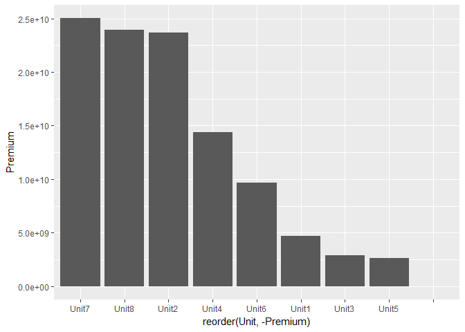

Data preparation for lesson 2 (KPI's, searching for bad looking portfolios)
================

``` r
# libraries
library(dplyr)
```

    ## 
    ## Attaching package: 'dplyr'

    ## The following objects are masked from 'package:stats':
    ## 
    ##     filter, lag

    ## The following objects are masked from 'package:base':
    ## 
    ##     intersect, setdiff, setequal, union

``` r
library(ggplot2)

# load data
dt_KPI_raw <- read.csv("../../data/lesson2_KPI.csv")
```

#### What type of information do we have?

> Hint: To have a quick overview of data use glimpse() function from dplyr

``` r
dt_KPI_raw %>% glimpse()
```

    ## Observations: 1,101
    ## Variables: 9
    ## $ Region    <fctr> Alandia, Alandia, Alandia, Alandia, Alandia, Alandi...
    ## $ Unit      <fctr> Unit1, Unit1, Unit1, Unit1, Unit1, Unit1, Unit1, Un...
    ## $ Segment   <fctr> Big, Big, Big, Big, Big, Big, Big, Big, Big, Big, B...
    ## $ Business  <fctr> Doctors, Doctors, Criminals, Criminals, Third Party...
    ## $ Year      <int> 2012, 2013, 2012, 2013, 2012, 2013, 2012, 2013, 2012...
    ## $ Losses    <dbl> 0.0, 0.0, 0.0, 0.0, 3261073.0, 0.0, 479087.2, 0.0, 0...
    ## $ Expenses  <dbl> -38128.56, 0.00, 140694.65, 0.00, 1217174.71, 178993...
    ## $ Premium   <dbl> 0.0, 0.0, 0.0, 0.0, 5079637.0, 5169344.6, 648345.2, ...
    ## $ UWR.Plan. <dbl> 0.00, 0.00, 0.00, 0.00, 0.00, 122975.69, 0.00, 39516...

It is good to know what your data contains and what the column names mean, usually Data Governance team could help you with this question. For now let's assume we know what our columns mean.

##### What do the columns contain?

> Hint: The function summary() might help you to answer this question

#### Looking for defects in data

##### Are there any missing values?

As a first task, try to find missings for a specific column only

``` r
# your code
```

Can you generalize this process for the whole dataset? &gt; Hint: Can you use any kind of loop here?

``` r
# your code
```

Are there any values that don't make any sense in the context of the data? Which vaules are not allowed for specific columns? Let's have a look at individual columns. &gt; Hint: Be prepared to deal with continuous and categorical values as well

``` r
# your code
```

#### Correction of defects

##### What is the feasible way to repair missing values?

``` r
# your code
```

##### What is the feasible way to repair values that don't make sense?

``` r
# your code
```

### Visualization of Raw Data

##### What makes sense to visualize (or compare using some visualization) in terms of KPIs?

Reflection - write a short comment to your notes in repository on what makes sense to look into.

#### Data preparation for visualization

##### Which Unit has collected the most Premium?

``` r
dt_KPI_raw %>% 
  group_by(Unit) %>% 
  summarize(Premium = sum(Premium, na.rm = TRUE)) %>% 
  arrange(desc(Premium))
```

    ## # A tibble: 9 x 2
    ##     Unit     Premium
    ##   <fctr>       <dbl>
    ## 1  Unit7 25022308349
    ## 2  Unit8 23907436423
    ## 3  Unit2 23655112544
    ## 4  Unit4 14406524753
    ## 5  Unit6  9682329806
    ## 6  Unit1  4710808179
    ## 7  Unit3  2914730950
    ## 8  Unit5  2628899319
    ## 9                  0

##### Which Unit has the lowest Expenses?

``` r
# your code
```

##### Which Business from Unit found in the previous task had the highest Expenses?

``` r
# your code
```

### Basic Visualization

#### Visualize your findings on simple bar charts - ggplot2::geom\_col()

##### Which Unit has collected the most Premium?

``` r
dt_KPI_raw %>% 
  group_by(Unit) %>% 
  summarize(Premium = sum(Premium, na.rm = TRUE),
            Expenses = sum(Expenses, na.rm = TRUE),
            Losses = sum(Losses, na.rm = TRUE)
  ) %>% 
  ggplot(aes(x = reorder(Unit, -Premium), y = Premium)) + 
  geom_col()
```



##### Which Unit has the lowest Expenses?

``` r
# your code
```

##### Which Business from Unit found in the previous task had the highest Expenses?

``` r
# your code
```

##### Bonus - Show all Costs Insurance Company has as a stacked bar for Expenses and Losses grouped by Units

``` r
# your code
```

Reflection - write a short comment to your notes in repository on what do you think is the best and the worst Unit performer. Feel free to do more data exploration.

------------------------------------------------------------------------

Building KPIs
-------------

##### Is there a better way to look into Losses/Expenses/Premium information?

``` r
# your code
```

### Visualization of KPIs

#### What makes sense to visualize/compare at visual level in terms of KPIs?

Try to find answers for the next questions using the KPIs you learned about \#\#\#\#\# Which Unit looks bad in terms of Losses?

``` r
# your code
```

##### Which Unit looks pretty good in terms of Expenses?

``` r
# your code
```

##### Which Business from previous Unit looks bad in terms of Expenses?

``` r
# your code
```

##### Bonus - Make a stacked bar for Losses and Expenses using the KPIs you learned about

``` r
# your code
```

> Does it help you to find something new?

Reflection again - write a short comment to your notes in repository on what you think is the best and the worst Unit performer based on what you have learned recently. Feel free to do more data exploration.

------------------------------------------------------------------------

### UWR (underwriting Result)

#### Is there even better way how to look at portfolios? Previously we spoke about Ratios and relative performance.

> Can you create something similar but as a performance in absolute numbers?

##### How could be absolute performance defined?

``` r
# your code
```

##### Which Unit looks pretty good in terms of UWR?

``` r
# your code
```

##### Which Business of previous Unit looks bad in terms of UWR?

``` r
# your code
```

Reflection again - write a short comment to your notes in repository on what do you think is the best and the worst Unit performer based on what you have learned recently. Feel free to do more data exploration.

------------------------------------------------------------------------

### shiny visualization

##### Where does it make sense to use dynamic range / create interactivity?

> Run command `shiny::shinyAppDir("Lessons/Lesson2/Shiny")` to see pre-defined application.

Edit files ui.R and server.R in folder `Lessons/Lesson2/Shiny` to adjust application for KPI metrics you have learnt today.

> Have you found something interesting we have not discuss during the lesson?
