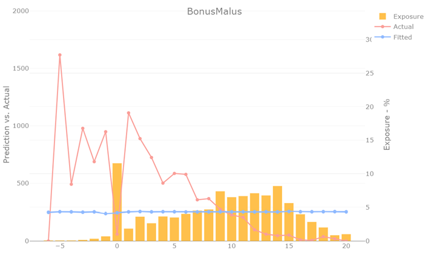
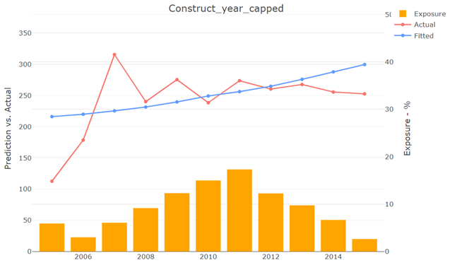

# Charakter domacej ulohy
Vo všeobecnosti platí, že **pri tejto úlohe nie je žiadne zlé riešenie**, v podstate od vás chceme aby ste pustili zopár modelov a napísali komentár prečo ste pridali dané premenné a či to model zlepšilo alebo zhoršilo.

# Pridavanie premennych
V zadaní úlohy budete mať definované akou konkrétnou premennou v modeli začať. Následné premenné môžte pridávať podľa vlastného výberu, zvážiť môžte nasledovné:
- **Znalosť domény** - vo vašom prípade skôr intuícia, ktoré aspekty poistenie aút budú mať vplyv na rizikovosť
- **Štatistický pohľad** – skúsiť premennú pridať a pozrieť sa na to či sú niektoré jej kategórie štatisticky významné (p-hodnota a hviezdičky vo výstupe z GLM)
- **Grafické porovnanie** skutočnej rizikovosti s predikovanou rizikovosťou – Tento prístup sme vám do istej miery ukazovali na hodine a je to v praxi najpoužívanejší prístup v poistnom modelovaní. Viac o tomto prístupe nižšie.

# Graf 'Actual' vs 'Fitted'
Tento graf má tri základné komponenty – 
1. **Exposure** - Žlté stĺpce vyjadrujú v ktorých kategóriach danej premennej je koľko dát (poistiek, resp. Poistko-rokov). Vyplýva z nazbieraných dát.
2. **Actual** – skutočná priemerná rizikovosť danej kategórie vyplývajúca z nazbieraných dát.
3. **Fitted** – modelom vypočítaná priemerná rizikovosť danej kategórie. Vyplýva a mení sa podľa použitého modelu.

V prípade pridávania / zvažovania premennej vás zaujíma situácia, kedy má premenná aký taký viditeľný trend skutočnej rizikovosti (Actual) a zároveň je predikovaná rizikovosť z modelu (Fitted) bez výraznej informácie, čiže skôr rovná čiara/krivka.  

V prípade hodnotenia už existujúcich premenných v modeli vás zaujíma nakoľko predikovaná rizikovosť z modelu (Fitted) kopíruje trend skutočnej rizikovosti (Actual) po pridaní premennej do modelu. 

# Uprava premennych
Druhou časťou úlohy je úprava premenných, ktoré už do modelu vložíte. Väčšinou je cieľom premennú sprehľadniť, čo často znamená znžiť počet kategórií/hodnôt. Zopár príkladov:
- Pri kategorickej premennej môžme **spájať dokopy kategórie** s podobnou rizikovosťou, prípadne malým zastúpením (Exposure). Príklad nájdete v materiáloch z hodiny.
- Pri ordinálnej alebo numerickej premennej môžeme **stanoviť minimálnu a maximálnu hodnotu** a zmeniť hodnoty mimo tohto rozsahu na okrajové hodnoty z daného rozsahu. Zväčša dáva zmysel rozsah stanoviť podľa distribúcie zastúpenia dát (Exposure). Príklad nájdete v materiáloch z hodiny.
- Pri niektorých typoch kategorických ale aj numerických premenných vieme sprehľadniť pomocou **skrátenia hodnoty** (napr. z 3-miestneho kódu skúsime urobiť 2-miestny alebo 1-miestny), tu môže byť zaujímavá funkcia `substr`. Alternatívna úprava pre numerické premenné ja napríklad **zaokrúhlenie alebo zmena jednotky** (napr. 1560ml, a 1570ml by sme obe zmenili na 1.6l).
- Posledným typom úpravy môže byť **kategorizácia / diskretizácia** numerickej premennej, tu môžu pomôcť funkcie `cut_interval` alebo `cut_width` z balíčka `ggplot2`.