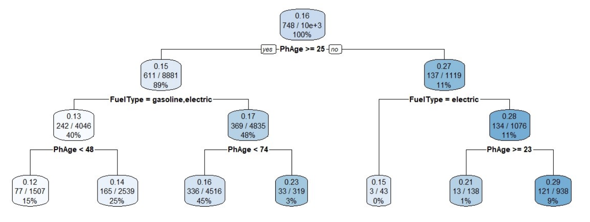
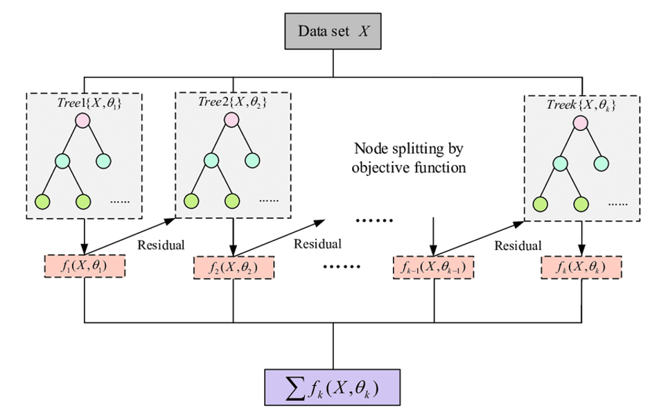
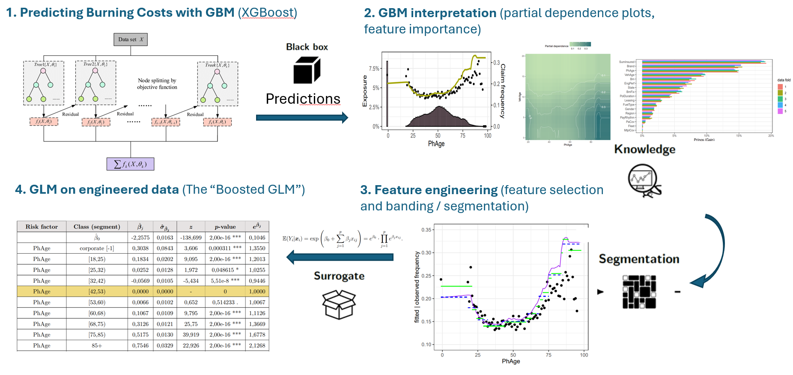
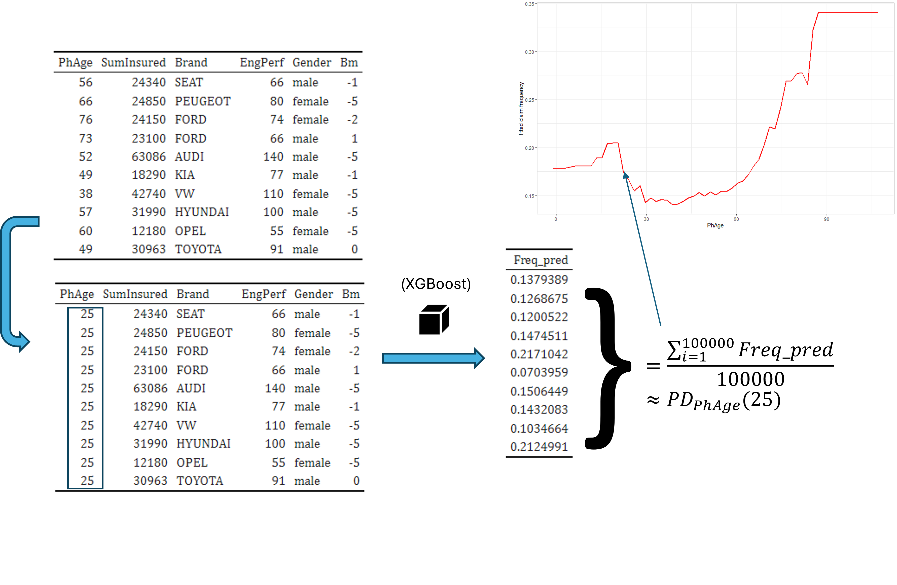

# What you'll learn in this lesson

-   Why we combine multiple **decision trees** to get a prediction

-   What are **Gradient Boosting Machines (GBMs)**

-   How are GBMs used in insurance pricing

-   How to preprocess data for GBMs

-   How to use insights from a GBM to construct a GLM

# Crash course on GBMs

## Decision tree is our base model

-   Goal is to find split points in our data set, that optimize our loss function (function describing how well our predictions match the observed targets)

-   A split point is a combination of a variable and threshold level (algorithm chooses the best split point at the current state of spitted data)

-   Create split points until some stopping criterion is activated, e.g. maximum allowed depth, number of observations in end nodes, maximum loss reduction achieved, ...



## Boosting the base model

-   The GBM algorithm is a specific realization of an iterative model that focuses on optimizing some loss function by constructing decision trees in a serial fashion

-   Each decision tree successor is predicting the errors of the previous tree until some stopping criterion is activated (number of trees, error rate reduction on validation sample, ...)

-   This concept is called **Boosting**

-   Motivation behind this idea: Combining multiple slightly different "weak learners" is better than producing one strong learner, because it's easy to make the strong learner overfit the data (e.g. neural network)

## Boosting visualized



## Using GBMs over GLMs

-   Pros:

    -   Higher accuracy (generally)

    -   Able to approximate any continuous relationship between feature and target variable

    -   automatic feature selection, robust to correlated features

-   Cons: Computationally intensive (compared to GLM)

    -   Black-box reputation

    -   Incompatible with (insurance) legacy systems

    -   Hyper-parameter tuning


## Using a black-box (GBM) to construct a GLM



# Fitting a baseline XGBoost burning cost model

```{r setup, include=FALSE}
knitr::opts_chunk$set(echo = TRUE)
```

```{r install and load packages, warning=FALSE}
# Check whether required packages are installed. If not, install them
libs <- c("xgboost", "dplyr", "ggplot2", "caret", "plotly")
lapply(libs, function(lib) {
  if (!lib %in% installed.packages()) install.packages(lib)
})

# Load the required packages
library(dplyr)
library(xgboost)
library(ggplot2)
library(caret)
library(plotly)
```

```{r source support functions}
# source support functions
functions_path <- file.path("/cloud/project/Support/functions")
functions_files <- list.files(
  functions_path, 
  pattern = "\\.R$"
)

invisible(lapply(file.path(functions_path, functions_files), source))
```

## Importance of EDA and data preparation

Data preparation and exploratory data analysis (EDA) are crucial for our analysis, because:

-   **Data preparation** ensures data quality:

    -   Handling missing values, outliers, Extreme values (Capping / Flooring)

    -   Scaling and transformation of data for better model performance

-   **EDA** helps understand the data:

    -   Identifies patterns, trends and relationship between variables

    -   Highlights anomalies or biases

    -   Informs feature selection and engineering (Imbalanced, correlated or unuseful variables)

Without these steps, the model might under perform or produce misleading results due to poor quality or misunderstood data. For more details on these steps, have a look at Support/02_data_prep.Rmd

```{r import prepared data}
data <- readRDS("/cloud/project/Data/data_gbm.rds")
```

Let's check the distribution of the target variable:

```{r check distribution of burning costs}
summary(data$Burning_Cost)
```

Capping large or extreme values in the target variable can be beneficial because it reduces the influence of outliers, improves model stability, enhances performance metrics, prevents overfitting, normalizes data distribution, and leads to more interpretable models. This helps in building models that generalize better to new data.

```{r check distribution of burning costs 2}
data %>%
  group_by(Burning_Cost) %>%
  count() %>%
  arrange(desc(Burning_Cost)) %>%
  head()
```

Let's calculate what is the theoretical maximum loss we should observe in our data with a 99.5% probability

```{r cap large losses 1}
prob_max_bc <- quantile(subset(data$Burning_Cost, data$Burning_Cost > 0), 0.995)
prob_max_bc
```

We will cap all losses above this value. In our case it's just two observations:

```{r cap large losses 2}
data <- data %>%
  mutate(
    Burning_Cost = ifelse(Burning_Cost >= prob_max_bc, prob_max_bc, Burning_Cost)
  )

summary(data$Burning_Cost)
```

## Data sampling

In machine learning, the dataset is typically split into three parts:

1.  **Training Set**: Used to train the model (60-80% of the data). It helps the model learn patterns and parameters.
2.  **Validation Set**: Used to tune hyperparameters and evaluate performance during training (10-20%). Ensures the model doesn't overfit.
3.  **Test Set**: Used only after training is complete to evaluate final performance on unseen data (10-20%).

```{r data sampling}
# split the dataset into modeling and testing part
set.seed(58742) # to fix randomizer

n_rows <- nrow(data)
model_idx <- sample(n_rows, round(0.85 * n_rows)) # 85/15 split between modeling and test

model <- data[model_idx, ]
test <- data[-model_idx, ]

# split the dataset into training and validation part
set.seed(12309)
n_rows <- nrow(model)
train_idx <- sample(n_rows, round(0.80 * n_rows)) # 80/20 split between train and valid

train <- model[train_idx, ]
valid <- model[-train_idx, ]

nrow(train)
nrow(valid)
nrow(test)
```

## Encode categorical variables

Machine learning algorithms can't process string values, therefore all categorical variables have to be encoded to numbers. For ordered categorical variables this is straightforward - we encode them to integer values (label encoding).

```{r data structure}
str(data)
```

Convert ordered factors Year, Nr_of_seats to integer levels:

```{r}
train <- train %>%
  mutate(across(where(is.ordered), ~ as.numeric(.)))

valid <- valid %>%
  mutate(across(where(is.ordered), ~ as.numeric(.)))

model <- model %>%
  mutate(across(where(is.ordered), ~ as.numeric(.)))

test <- test %>%
  mutate(across(where(is.ordered), ~ as.numeric(.)))

train %>% select(Nr_of_seats) %>% distinct()
data %>% select(Nr_of_seats) %>% distinct()
```

Nominal categorical variables are more tricky because the attributes don't have a natural or numeric order. These variables we will encode with the One-Hot Encoding method. With One-Hot we create binary columns for each category. If a feature has three categories ("red", "blue", "green"), three new columns are created, each representing one category with 0s and 1s. This avoids implying any ordinal relationship.

These are categorical variables which we need to encode: Customer_Type, D_ZIP, VEH_type, Veh_type2, VEH_brand.

```{r}
train_encoded <- apply_onehot(feature_set = train)
valid_encoded <- apply_onehot(feature_set = valid)
model_encoded <- apply_onehot(feature_set = model)
test_encoded <- apply_onehot(feature_set = test)

train_encoded %>% select(starts_with("D_ZIP")) %>% distinct()
```

## Train XGBoost

```{r}
train_mat <- train_encoded %>% select(-Burning_Cost, -Time_Exposure) %>% as.matrix()
valid_mat <-  valid_encoded %>% select(-Burning_Cost, -Time_Exposure) %>% as.matrix()
model_mat <-  model_encoded %>% select(-Burning_Cost, -Time_Exposure) %>% as.matrix()
test_mat <- test_encoded %>% select(-Burning_Cost, -Time_Exposure) %>% as.matrix()
```

```{r}
# Create xgboost input objects from data, weights and labels
dtrain <- xgb.DMatrix(
  data = train_mat,
  label = train_encoded$Burning_Cost,
  weight = train_encoded$Time_Exposure
)

dvalid <- xgb.DMatrix(
  data = valid_mat,
  label = valid_encoded$Burning_Cost,
  weight = valid_encoded$Time_Exposure
)

dmodel <- xgb.DMatrix(
  data = model_mat,
  label = model_encoded$Burning_Cost,
  weight = model_encoded$Time_Exposure
)
```

```{r}
# Create the watchlist
watchlist <- list(train = dtrain, test = dvalid)

# Set parameters for the XGBoost model
params <- list(
  objective = "reg:tweedie",
  tweedie_variance_power = 1.85, # not an XGBoost hyperparameter: Should be chosen based on the target distribution. 
  max_depth = 6, # controls the maximum depth of a single tree
  eta = 0.1, # aka learning rate: scales the predicted errors of each tree
  min_child_weight = 1000 # controls how large child nodes can get expressed as the sum of the hessian
)

# Train the model with the watchlist
xgb_baseline <- xgb.train(
  params = params,
  data = dtrain,
  nrounds = 10000,
  watchlist = watchlist,
  early_stopping_rounds = 20,
  verbose = 1
)
```

# XGBoost Interpretation

Now let's look at how our model performs. We will use the following methods for interpretation:

1.  Lift Chart
2.  Feature Importance Chart
3.  Partial Dependence Plots (PDP) and Oneway Analysis

By using these techniques, we can gain valuable insights into our XGBoost model and understand its behavior better. This helps us make informed decisions and improve the model's performance further.

## Lift chart

The lift chart shows us how accurate our model is. It helps us understand whether the model is underestimating or overestimating in some areas. By comparing the predicted values to the actual values, we can assess the model's performance across different segments of the data. We can see that there are some bins which are overestimated or underestimated.

```{r lift chart}
lc <- lift_curve(
  data = valid,
  target_variable = "Burning_Cost",
  weights_input = "Time_Exposure",
  pred_fun = calculate_predictions,
  is_apply_onehot = TRUE,
  object = xgb_baseline
)

lc
```

## Feature Importance Chart

Gain-based feature importance evaluates the importance of features in decision tree-based models (e.g., Random Forest, XGBoost) by measuring the improvement (gain) a feature provides when it is used to split the data.

1.  Gain Calculation: Each time a feature is used to split the data, it increases the model's performance (gain).
2.  Accumulated Gain: The gains are summed across all splits and trees where the feature appears.
3.  Normalization: The total gain for each feature is divided by the total gain across all features to get relative importance scores.
4.  Feature Importance Score: Features are ranked based on these normalized gain values.

```{r feature importance}
xgb_fi <- xgb.importance(model = xgb_baseline)
xgb.ggplot.importance(xgb_fi)
```

## Partial Dependence Plots (PDP) and Oneway Analysis

These plots help us understand the relationship between the target variable and individual predictors. PDPs show how the target variable changes across different levels of the explored variable. For example, if we look at the "PhAge" variable, we can see that the PDP decreases as "PhAge" increases from circa 20 to 40, which means the risk in terms of loss amount decreases. As we go from "PhAge" 40 till circa 90, the risk increases. Tree based methods can't extrapolate and because there's not enough data after age 90, so they predict a straight line.

{width="1031"}

Oneway analysis provides a similar insight by exploring the model's performance per variable levels, helping us identify any overestimation or underestimation for specific levels.

```{r oneway}
fitted_vars <- colnames(data %>% select(-Time_Exposure,-Burning_Cost))

# plots <- list()
# 
# for (var_nm in fitted_vars) {
#   plots[[var_nm]] <- calculate_oneway(
#     data = valid,
#     model = xgb_baseline,
#     var = var_nm,
#     pred_fun = calculate_predictions,
#     is_apply_onehot = TRUE,
#     target_name = "Burning_Cost",
#     weight_name = "Time_Exposure"
#   )
# }
# 
# saveRDS(plots, "/cloud/project/Data/oneway_baseline.RDS")

plots <- readRDS("/cloud/project/Data/oneway_baseline.RDS")

for (var_nm in fitted_vars) {
  print(plots[[var_nm]])
}

```
